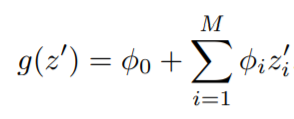

# Explainable Federated Learning

Understanding why a model makes a certain prediction and how a feature value contributes to the
predict result are as the same importance as training a accurate model. For a better understanding
of trained federated models, in FATE-1.8 we provides a brand new module 'Model Interpret' which
offers novel model-interpretation algorithms specifically designed for federated machine learning.

# SHAP Based Methods

SHAP(SHapley Additive exPlanations) is one of the most widely used Model-Agnostic methods [1] in explainable machine learning. 
It is developed mainly on two basic concepts: Additive feature attribution methods and Shapley Values. 
Here we briefly introduce SHAP and Federated SHAP developed based on SHAP.

Additive feature attribution methods have an explanatory model that is a linear function of binary variables[2].
Give a machine learning model *f*, 
assuming we have an instance *x* with *M* features, φ denotes the contribution  made by a certain feature value. 
*z* is a vector of *M* dimension and it only contains 0 and 1, indicating a feature exists or not. *z'* is a 
all 1 vector. *g* is a explainable additive model and we have *f(x)=g(z')*.To explain the predict result, we use
definition:

to represent an additive feature attribution model. In a nutshell, in the perspective of the additive feature attribution method, instance feature values contribute 
to the predict result, and their contributions sum up to get the predict result. From this simple additive method, 
we are able to have a straight view of feature importance and relate features with a realistic interpretation.

Below formula shows the definition of additive feature attribution methods:

The Shapley value is a game theory concept that involves fairly 
distributing both gains to several players working in a coalition.  
      
                        
                       
## Hetero and Homo Kernel SHAP

How

## Hetero and Homo Tree SHAP

## Reference
[1]https://christophm.github.io/interpretable-ml-book/local-methods.html

[2]A unified approach to interpreting model predictions. Scott M. Lundberg and Su-In Lee. 2017. In Proceedings of the 31st International Conference on Neural Information Processing Systems

[3]