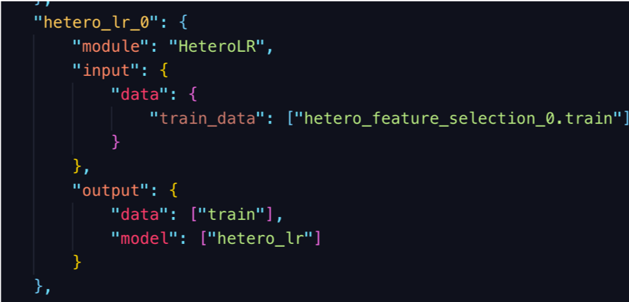
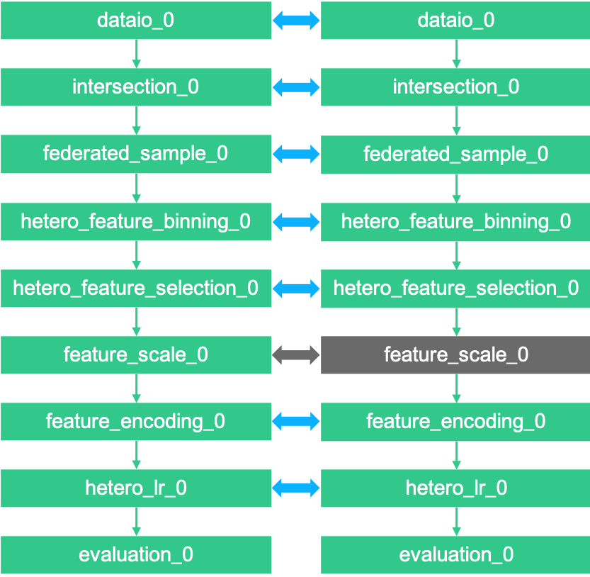

# FATE-Flow
## Introduction
FATE-Flow is a end to end pipeline platform for Federated Learning. Pipeline is a sequence of components which is specifically designed for highly flexible, high performance federated learning tasks. That includes data processing, modeling, training, verification, publishing and serving inference.


### FATE-Flow Federated Learning Pipeline


### FATE-Flow now supports

- DAG define Pipeline
- Describe DAG using **FATE-DSL** in **JSON** format
- FATE has a large number of default federated learning components, such as Hetero LR/Homo LR/Secure Boosting Tree and so on.
- Developers can easily implement custom components using Basic-API and build their own Pipeline through DSL.
- Federated Modeling Task Life-cycle Manager, start/stop, status synchronization and so on.
- Powerful Federated Scheduler, support multiple scheduling strategies for DAG Job and Component Task.
- Real-time tracking of data, parameters, models, and metric during the experiment.
- Federated Model Manager, model binding, versioning and deployment tools.
- Provide HTTP API and Command Line Interface.
- Data and interface support for modeling visualization on **FATE-Board**.


## Build Pipeline
### DSL Example


### Write a DSL
Only one step is required to configure a component for pipeline.

- define the module of this component
- define the input, includes data, model or isometric_model(only be used for FeatureSelection)
- define the output, includes data and model



### Pipeline Run Example



<div style="text-align:center", align=center>

</div>


## Architecture


## Deploy
Fate-flow is deployed in ``$PYTHONPATH/fate_flow/``. It depends on two configuration files: ``$PYTHONPATH/arch/conf/server.conf``, ``$PYTHONPATH/fate_flow/settings.py``


### server.conf
Server.conf configures the address of all FATE services. FATE-Flow of different deployment modes needs different fate services. For details, please refer to the following specific deployment mode.


### settings.py
Key configuration item description:

| Configuration item | Configuration item meaning | Configuration item value |
| - | - | - |
| IP | listen address for FATE-Flow | default 0.0.0.0 |
| GRPC_PORT | listen port for the grpc server of FATE-Flow | default 9360 |
| HTTP_PORT | listen port for the grpc server of FATE-Flow | default 9380 |
| WORK_MODE | the work mode of FATE-Flow | 0 for standalone, 1 for cluster |
| USE_LOCAL_DATABASE | Whether to use a local database(sqlite) | False for no, True for yes |
| MAX_CONCURRENT_JOB_RUN | Pipeline jobs that are executed in parallel at the same time | default 5 |
| DATABASE | configuration for mysql database | custom configuration |
| REDIS | configuration for redis | custom configuration |
| REDIS_QUEUE_DB_INDEX | the redis db index of redis queue | default 0 |


### service.sh
Server start/stop/restart script

| Configuration item | Configuration item meaning | Configuration item value |
| - | - | - |
| PYTHONPATH | the python path | Absolute path to the parent directory of the FATE-Flow |
| venv | the python virtual environment | custom configuration, such as /data/projects/fate/venv, not /data/projects/fate/venv/bin/activate |


### Simple Standalone
You only need to start the FATE-Flow service to run the federated learning modeling experiment.

##### **Configuration**
| Configuration item | Configuration item value |
| - | - |
| WORK_MODE | 0 |
| USE_LOCAL_DATABASE | True |

##### **Features**
- Use **Sqlite** as database, db file is fate_flow_sqlite.db on the FATE-Flow root directory.
- Use in-process queue as job queue.
- Multi-Party communication loop back.
- But can not use FATE-Board because it doesn't support sqlite! In the next version board will support sqlite.


### Standard Standalone
You need to deploy three service:

- MySQL
- FATE-Flow
- FATE-Board

##### **Docker version**

FATE provides a standalone version of the docker for experience.please refer to docker version deploy guide at [docker-deploy](../standalone-deploy/docker).

##### **Manual version**

FATE provides a tar package with basic components to enable users to run FATE in a stand-alone environment, in which users are required to install dependent components on their own.please refer to manual deploy guide at [manual-deploy](../standalone-deploy/Manual). 

##### **Configuration**
| Configuration item | Configuration item value |
| - | - |
| WORK_MODE | 0 |
| USE_LOCAL_DATABASE | False |
| DATABASE | configuration for mysql database | custom configuration |

##### **Features**
- Use **MySQL** as database.
- Use in-process queue as job queue.
- Multi-Party communication loop back.
- Support visualization by FATE-Board !


### Cluster
FATE also provides a distributed runtime architecture for Big Data scenario. Migration from standalone to cluster requires configuration change only. No algorithm change is needed. 
To deploy FATE on a cluster, please refer to cluster deploy guide at [cluster-deploy](../cluster-deploy). 

##### **Configuration**
| Configuration item | Configuration item value |
| - | - |
| WORK_MODE | 1 |
| DATABASE | configuration for mysql database | custom configuration |
| REDIS | configuration for redis | custom configuration |

##### **Features**
- Use **MySQL** as database.
- Use **redis queue** as job queue.
- Multi-Party communication use **proxy**.
- Support visualization by FATE-Board !


## Usage
FATE-Flow provide [**REST API**](./doc/fate_flow_rest_api.md) and [**Command Line Interface**](./doc/fate_flow_cli.md). 
Let's start using the client to run a Federated Learning Pipeline Job example(**Standalone**).

### Offline Modeling
#### Upload Data
```bash
python fate_flow_client.py -f upload -c examples/upload_guest.json
python fate_flow_client.py -f upload -c examples/upload_host.json
```

#### Submit Job
```bash
python fate_flow_client.py -f submit_job -d examples/test_hetero_lr_job_dsl.json -c examples/test_hetero_lr_job_conf.json
```
Command response example:
```json
{
    "data": {
        "board_url": "http://localhost:8080/index.html#/dashboard?job_id=2019081718211974471912&role=guest&party_id=10000",
        "job_dsl_path": "xxx/jobs/2019081718211974471912/job_dsl.json",
        "job_runtime_conf_path": "xxx/jobs/2019081718211974471912/job_runtime_conf.json",
        "model_info": {
            "model_id": "arbiter-10000#guest-10000#host-10000#model",
            "model_version": "2019081718211974471912"
        }
    },
    "jobId": "2019081718211974471912",
    "meta": null,
    "retcode": 0,
    "retmsg": "success"
}
```
Some of the following operations will use these response information.

#### Query Job
```bash
python fate_flow_client.py -f query_job -r guest -p 10000 -j $job_id
```
And then, you can found so many useful command from [**CLI**](./doc/fate_flow_cli.md).

##### For more Federated Learning pipeline Job example, please refer at [**federatedml-1.0-examples**](../examples/federatedml-1.0-examples) and it's [**README**](../examples/federatedml-1.0-examples/README.md)


### Online Inference
Publish model to **FATE-Serving**, and then using Serving's GRPC API to inference. Please confirm that you have deployed **FATE-Serving** and configured the service address in **server.conf**. You can refer to the cluster deployment.

#### Publish Model
```bash
python fate_flow_client.py -f load -c examples/publish_load_model.json
```
Please replace the corresponding configuration in ``publish_load_model.json`` with your job configuration.
After that, you can make online inference request to FATE-Serving by specifying the model id and model version used.

#### Publish Model Online Default
```bash
python fate_flow_client.py -f online -c examples/publish_online_model.json
```
Please replace the corresponding configuration in ``publish_online_model.json`` with your job configuration.
After that, the FATE-Serving uses the configuration you provided to set the party's default model id and the default model version that involves the model id.
And then, will you can make online inference request to FATE-Serving by only specifying the party_id or the model id.


## Logs
#### FATE-Flow Server log
``$PYTHONPATH/logs/fate_flow/``

#### Job log
``$PYTHONPATH/logs/$job_id/``


## FAQ
#### Can not use query job command to query upload/download data job
- In this version, the job that uploads/downloads data is not a job of pipeline type, so you cannot use the query job command to query the status. Please check the ``$PYTHONPATH/jobs/$job_id/std.log``, sorry for the inconvenience.
- In the next version, the upload/download data will be upgraded, and you can use the query job command to query the status.

#### Can not found job log directory in ``logs`` directory
- Usually we recommend using the job_log command by fate_flow_client to download the job log to a custom directory.
- If you cannot download the log under certain abnormal conditions, go to ``$PYTHONPATH/logs/fate_flow/fate_flow_stat.log`` to view it.
