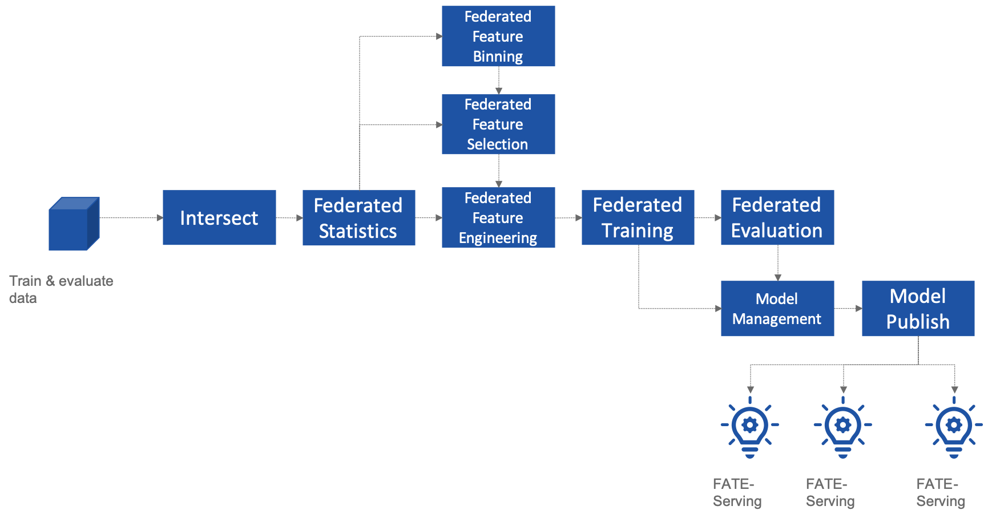
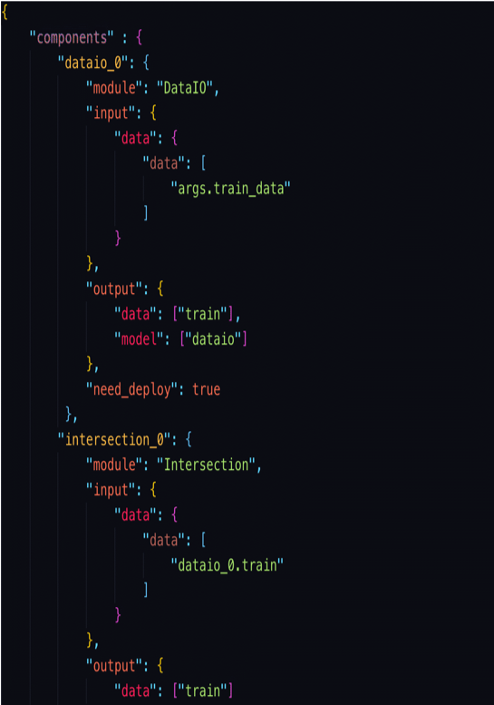

# FATE-Flow
## 简介
FATE-Flow是用于联邦学习的端到端Pipeline系统.它由一系列高度灵活的组件构成, 专为高性能的联邦学习任务而设计. 其中包括数据处理, 建模, 训练, 验证, 发布和在线推理等功能.


### FATE-Flow联邦学习Pipeline



### FATE-Flow现在支持:

-使用DAG定义Pipeline
-使用 **JSON** 格式的 **FATE-DSL** 描述DAG
-FATE具有大量默认的联邦学习组件, 例如Hetero LR/Homo LR/Secure Boosting Tree等.
-开发人员可以使用最基本的API轻松实现自定义组件, 并通过DSL构建自己的Pipeline.
-联邦建模任务生命周期管理器, 启动/停止, 状态同步等.
-强大的联邦调度管理, 支持DAG作业(job) 和组件任务的多种调度策略.
-运行期间实时跟踪数据, 参数, 模型和指标.
-联邦模型管理器, 模型绑定, 版本控制和部署工具.
-提供HTTP API和命令行界面.
-提供可视化支持, 可在 **FATE-Board** 上进行可视化建模.


##建立Pipeline
### DSL示例



###编写DSL
仅需一步就可以为Pipeline配置组件.

-定义此组件的模块
-定义输入, 包括数据, 模型或isometric_model(仅用于FeatureSelection)
-定义输出, 包括数据和模型


###Pipeline运行示例


##架构


##部署
Fate-Flow 部署在 ``$PYTHONPATH/fate_flow/``中. 它依赖两个配置文件：``$PYTHONPATH/arch/conf/server.conf``, ``$PYTHONPATH/fate_flow/settings.py``


### server.conf
在 server.conf 配置所有 FATE 服务的地址. 不同部署模式的 FATE-Flow 需要不同的Fate服务. 有关详细信息, 请参考以下特定的部署模式.


### settings.py
关键配置项说明:

|配置项|配置项含义|配置项值|
| - | - | - |
| IP | FATE-Flow 的监听地址 | 默认0.0.0.0 |
| GRPC_PORT | 监听 FATE-Flow grpc 服务的端口 | 默认9360 |
| HTTP_PORT | FATE-Flow的http服务器的侦听端口 | 默认9380
| WORK_MODE | FATE-Flow的工作模式 | 0(单机模式), 1(群集模式)|
| USE_LOCAL_DATABASE  |是否使用本地数据库(sqlite) | False表示否, True表示是|
| USE_AUTHENTICATION | 是否启用身份验证 | False表示否, True表示是|
| USE_CONFIGURATION_CENTER |是否使用Zookeeper | False表示否, True表示是|
| MAX_CONCURRENT_JOB_RUN | 同时并行执行的Pipeline作业(job) 数量 | 默认5 |
| MAX_CONCURRENT_JOB_RUN_HOST | 最大运行作业(job) 数量 | 默认值10 |
| 数据库| mysql数据库的配置 | 定制配置
| REDIS | Redis的配置 | 定制配置
| REDIS_QUEUE_DB_INDEX | Redis队列的Redis数据库索引|默认值0 |


### service.sh
服务器启动/停止/重启脚本

|配置项|配置项含义|配置项值|
| -| -| -|
| PYTHONPATH | python路径| FATE-Flow父目录的绝对路径|
| venv | python虚拟环境|自定义配置, 例如/data/projects/fate/venv, 而不是/data/projects/fate/venv/bin/activate |


### 简单单机部署
您只需要启动FATE-Flow服务即可运行联邦学习建模实验.

##### **配置**
| 配置项 | 配置项值|
| - | - |
| WORK_MODE | 0 |
| USE_LOCAL_DATABASE | True |

##### **Features**
-使用 **Sqlite** 作为数据库, db文件是 FATE-Flow 根目录上的fate_flow_sqlite.db.
-使用进程内队列作为作业(job) 队列.
-多方通讯回环.
-但无法使用FATE-Board, 因为它不支持sqlite! FATE-board的下一个版本将支持sqlite.


### 标准单机部署
您需要部署三个服务：

- MySQL
- Fate-Flow 
- FATE-Board

##### **Docker版本**

我们提供了FATE单机版的Docker版本以方便大家体验FATE. 请参阅[docker-deploy](../standalone-deploy/docker)上的docker版本部署指南.

##### **配置**
|配置项 | 配置项值|
| - | - |
| WORK_MODE | 0 |
| USE_LOCAL_DATABASE | False |
|数据库| mysql数据库的配置  |

##### **Features**
-使用 **MySQL** 作为数据库.
-使用进程内队列作为作业(job) 队列.
-多方通讯回环.
-可通过FATE-Board实现可视化!


###群集
FATE还为大数据场景提供了分布式框架. 从单机迁移到群集仅需要更改配置, 无需更改算法.
要在群集上部署FATE, 请参阅群集部署指南, 位于[cluster-deploy](./../cluster-deploy).

##### **配置**
|配置项 | 配置项值|
| -| -|
| WORK_MODE | 1 |
|数据库| mysql数据库的配置定制配置
| REDIS | Redis的配置 |

##### **Features**
-使用**MySQL**作为数据库.
-使用**redis队列**作为作业(job) 队列.
-多方通信使用**代理**.
-可通过FATE-Board实现可视化!


##用法
FATE-Flow提供 [**REST API**](./doc/fate_flow_rest_api.md)和[**命令行界面**](./doc/fate_flow_cli.md).
让我们开始使用 client端 来运行一个联邦学习Pipeline作业(job) (**单机版本**).

###离线建模
####上传数据
```bash
python fate_flow_client.py -f upload -c examples/upload_guest.json
python fate_flow_client.py -f upload -c examples/upload_host.json
```

####提交作业(job) 
```bash
python fate_flow_client.py -f submit_job -d examples/test_hetero_lr_job_dsl.json -c examples/test_hetero_lr_job_conf.json
```
命令响应示例：
```json
{
    "data": {
        "board_url": "http://localhost:8080/index.html#/dashboard?job_id=2019121910313566330118&role=guest&party_id=9999",
        "job_dsl_path": "xxx/jobs/2019121910313566330118/job_dsl.json",
        "job_runtime_conf_path": "xxx/jobs/2019121910313566330118/job_runtime_conf.json",
        "logs_directory": "xxx/logs/2019121910313566330118",
        "model_info": {
            "model_id": "arbiter-10000#guest-9999#host-10000#model",
            "model_version": "2019121910313566330118"
        }
    },
    "jobId": "2019121910313566330118",
    "retcode": 0,
    "retmsg": "success"
}

```
以下某些操作将用到上面这些响应信息。

####查询作业(job) 
```bash
python fate_flow_client.py -f query_job -r guest -p 10000 -j $job_id
```
然后, 您可以在[**CLI**](./doc/fate_flow_cli.md) 中找到更多有用的命令。

#####有关更多联邦学习Pipeline作业(job) 示例, 请参考[**federatedml-1.x-examples**](./../examples/federatedml-1.x-examples) 和 [**README**](./../examples/federatedml-1.x-examples/README.md) 


###在线推理
将模型发布到**FATE-Serving**, 然后使用Serving的GRPC API进行在线推理。 请确认您已部署**FATE-Serving**并在**server.conf**中配置了服务地址。 您可以参考集群部署。

####发布模型
```bash
python fate_flow_client.py -f load -c examples/publish_load_model.json
```

请使用您(自己)的作业配置(job configuration)替换 ``publish_online_model.json`` 中的相应配置。
之后, 您可以通过指定所使用的模型ID和模型版本来向FATE-Serving提出在线推理请求。

####在线发布默认模型 (Publish Model Online Default)
```bash
python fate_flow_client.py -f bind -c examples/bind_model_service.json
```
请使用您的作业(job) 配置(job configuration) 替换publish_online_model.json中的相应配置。
之后, FATE-Serving会使用您提供的配置来设置参与方的默认模型ID和涉及该模型ID的默认模型版本。
然后, 您可以仅通过指定party_id或模型ID来向FATE-Serving提出在线推理请求。


##日志
#### FATE-Flow服务日志
``$PYTHONPATH/logs/fate_flow/``

####作业(job) 日志
``$PYTHONPATH/logs/$job_id/``


## 常见问题

#### FATE-FLOW在FATE中的作用以及代表的意义是什么？
- FATE-Flow是一个调度系统, 可根据用户提交的作业(job) 的DSL调度算法组件的执行。


#### ModuleNotFoundError: No module named "arch"
- 将PYTHONPATH设置为fate_flow的父目录。


####提交任务时, 为什么任务显示成功, 但是在dashboard页面上任务失败？
- 提交成功仅表示作业(job) 已提交但未执行。如果作业(job) 失败, 则需要检查日志。
- 您可以通过面板查看日志。


####guest, host, arbiter和local在FATE中的作用以及代表的意义是什么？
-arbiter 用于协助多方完成联合建模。它的主要作用是汇总并处理模型中间结果。 例如, 在纵向lr中, 各方将其梯度的一半发送给arbiter, 然后由arbiter汇总并处理。
-guest代表数据应用方。
-host是数据提供者。
-local是指本地任务, 该角色仅用于upload和download阶段中。


####杀死(kill)等待的作业(job) 时出现有关“cannot find xxxx”的错误
-Fate_flow当前仅在作业(job) 启动器上支持kill, 执行kill将报告“cannot find xxxx”。


####upload命令在做什么？

-上载数据被上载到eggroll, 并加载为可由后续算法处理的DTable格式。


####如何下载执行过程中生成的数据？
-您可以使用``python fate_flow_client.py -f component_output_model -j $job_id -r $role -g $guest -cpn $component_name -o $output_path``


####如果同一文件上传执行了两次, FATE将删除第一个数据并再次上传吗？
-如果同一表的键值相同, 它将被覆盖。


####作业(job) 失败而在board上没有错误显示的原因是什么？
-这些日志不会显示在board上：```$job_id/fate_flow_schedule.log```, ``logs/error.log``, ``logs/fate_flow/ERROR.log`` .


#### load和bind命令有什么区别？
-load可以理解为模型的release版本, 而bind是默认模型版本。